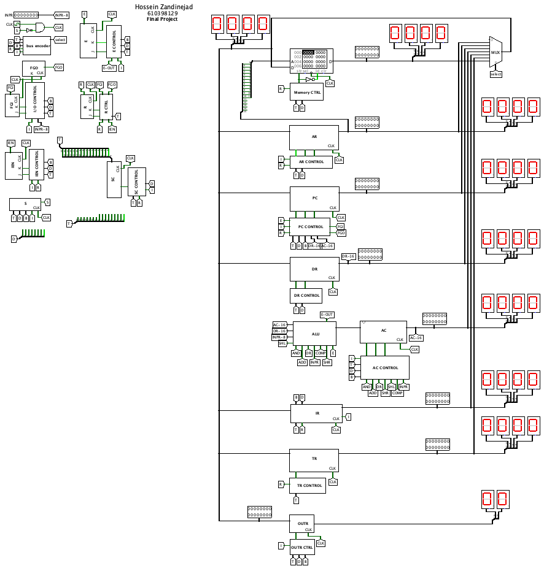

# 16-Bit-CPU
Designing a 16 bit CPU with Logisim



## Table of Contents

- [Overview](#overview)
- [Features](#features)
- [Getting Started](#getting-started)
  - [Prerequisites](#prerequisites)
  - [Usage](#usage)
- [License](#license)
- [Acknowledgments](#acknowledgments)
- [Contact](#contact)
  
## Overview

This repository contains the design and implementation of a 16-bit Central Processing Unit (CPU) using Logisim, a powerful digital logic simulator. The CPU is capable of executing a basic instruction set and can be used as a learning tool for understanding computer architecture and digital logic design principles.

## Features

- 16-bit architecture for word size.
- Basic instruction set.
- Register-based architecture.
- ALU (Arithmetic Logic Unit) for arithmetic and logic operations.
- Control unit for instruction decoding and execution.

## Getting Started

### Prerequisites

Before you can use or modify this CPU design, you will need to have Logisim installed on your computer. You can download Logisim from [here](http://www.cburch.com/logisim/).

### Usage

1. Clone this repository to your local machine:
``` bash
git clone https://github.com/yourusername/16-bit-CPU-Logisim.git
```
2. Open Logisim and load the CPU circuit file (`16-bit-CPU.circ`) from the repository.

3. You can interact with the CPU by providing inputs through the circuit's interface and observing the outputs.

4. To modify or extend the CPU design, open the circuit in Logisim's edit mode and make changes as needed. Refer to the Logisim documentation for guidance on using the tool.

## License

This project is licensed under the MIT License - see the [LICENSE](LICENSE) file for details.

## Acknowledgments

We would like to thank the Logisim community and all contributors for their valuable insights and contributions to this project.

## Contact

If you have any questions or suggestions, feel free to contact us at your.email@example.com.

Happy coding!

